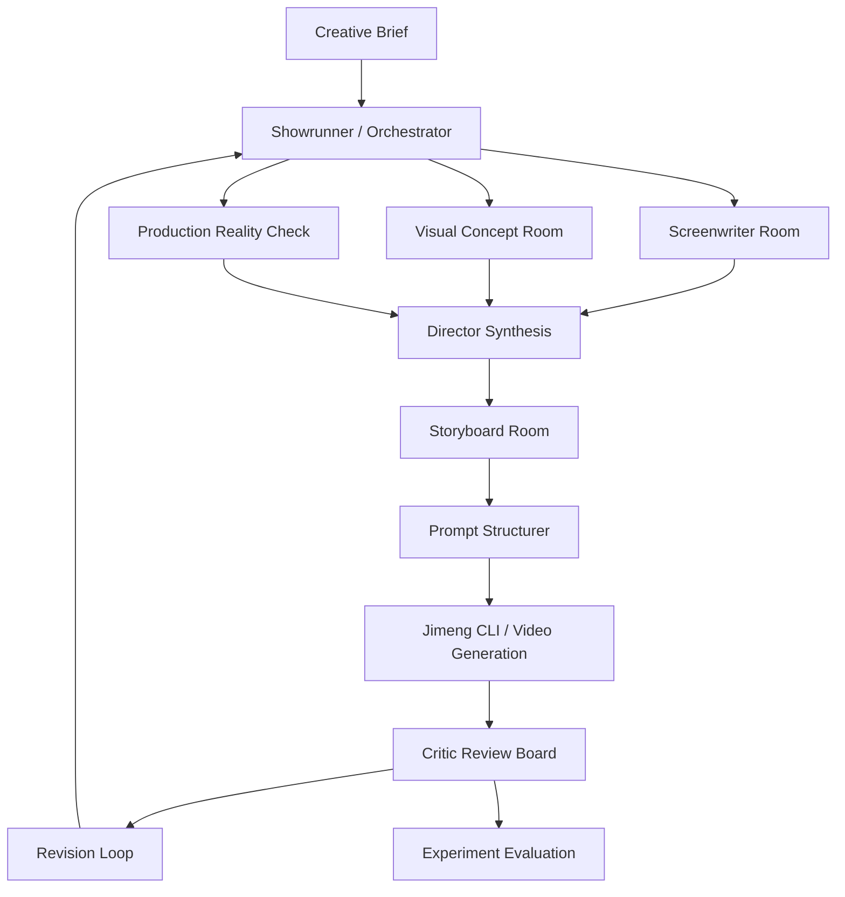

# Agent Team Architecture

## 设计原则

这个 Agent Team 模拟一个小型电影制作组，而不是简单让多个模型轮流说话。

核心原则：

- **每个 Agent 必须产出可审查物**，不能只给建议。
- **关键节点必须有反方审查**，尤其是创意、剧本、视觉风格、分镜、成片诊断。
- **导演 / Showrunner 拥有最终取舍权**，避免多 Agent 把项目带散。
- **所有判断都落到可执行媒介**：剧本、分镜、镜头、光影、表演、剪辑、即梦 prompt。
- **过程产物本身纳入评估**，因为产品价值不只在最终视频，也在创作者是否更容易判断和迭代。

## 总体拓扑



## 主 Agent 与 Sub Agent

### 1. Showrunner / 总控 Agent

职责：

- 读取用户 brief，确认影片核心命题。
- 控制 10 分钟体量，避免扩成一部长片。
- 决定哪些建议进入下一版。
- 维护项目记忆：主题、角色、视觉规则、禁区、预算、时长。

关键产物：

- `project_bible.md`
- `decision_log.md`
- `revision_brief.md`

### 2. 编剧室 Screenwriting Room

建议子角色：

- **编剧**：生成故事核、人物、结构、场景。
- **剧本医生**：审查钩子、冲突、弧光、节奏、台词。
- **反方编剧**：专门指出俗套、虚假转折、解释性对白。

核心方法：

- 10 分钟只讲一个核心事件。
- 每场戏必须有目标、阻碍、结果。
- 前 15 秒要有“不对劲”的钩子。
- 结尾用画面展示新常态，不靠角色解释主题。

关键产物：

- `logline.md`
- `character_arc.md`
- `four_act_outline.md`
- `scene_list.md`
- `screenplay_v*.md`
- `script_doctor_report.md`

### 3. 美术概念设计室 Visual Concept Room

建议子角色：

- **美术概念设计师**：把主题翻译成世界观、空间、道具、材质、色彩。
- **风格策展人**：建立 moodboard 和参考体系，不直接盗用私人风格资产。
- **摄影指导**：决定景别、焦段、镜头、光圈、布光、景深。

来自创作者访谈的关键洞察：

- “电影感”不能只写高级感，要落到焦段、光线、色彩区间、人物视线、构图动机。
- 风格不是单张垫图，而是 moodboard 级别的整体 manner。
- 提示词不是越长越好，冗余和矛盾描述会降低效果。

关键产物：

- `visual_bible.md`
- `moodboard_spec.md`
- `color_script.md`
- `character_design_spec.md`
- `location_design_spec.md`
- `cinematography_rules.md`

### 4. 导演 Agent

职责：

- 把剧本、美术、摄影统一成导演阐述。
- 决定观众在每场戏应该感到什么。
- 确保镜头不是展示资产，而是推动情绪和故事。

关键产物：

- `director_statement.md`
- `scene_intent_table.md`
- `blocking_notes.md`

### 5. 粗分镜 / 细分镜 Agent

粗分镜职责：

- 把场景拆成镜头段落。
- 确定每个镜头的戏剧功能、景别、运动、情绪。

细分镜职责：

- 输出可给即梦使用的 shot spec。
- 检查角色尺寸、视线方向、轴线、连续性、前后镜头衔接。

关键产物：

- `coarse_storyboard.md`
- `fine_storyboard.csv`
- `shot_continuity_check.md`

### 6. 制片人 Agent

职责：

- 控制 10 分钟制作可行性。
- 评估镜头数量、生成成本、重试风险、资产复用。
- 给出“必须做 / 可以降级 / 应删掉”的制作建议。

关键产物：

- `production_plan.md`
- `cost_risk_table.md`
- `asset_reuse_plan.md`

### 7. 剪辑 Agent

职责：

- 设计节奏波形。
- 判断哪些镜头需要空镜、反应镜头、静默、跳切、长镜头。
- 检查 10 分钟是否有节奏疲劳。

关键产物：

- `edit_rhythm_map.md`
- `assembly_notes.md`
- `trailer_or_hook_cut.md`

### 8. AI 演员演技指导 Agent

职责：

- 把“紧张、愤怒、释然”等抽象情绪翻译为可见动作。
- 指定视线方向、呼吸、停顿、嘴唇、手部、小动作。
- 避免角色直视镜头导致“拍照感”，除非叙事需要。

关键产物：

- `performance_beats.md`
- `actor_direction_table.md`

### 9. 审片人 Critic Agent

职责：

- 审剧本、审分镜、审即梦生成结果。
- 明确指出问题属于剧本、视觉、镜头、表演、剪辑、提示词还是工具能力。
- 给下一轮修改 brief，而不是泛泛说“更电影感”。

关键产物：

- `review_report_v*.md`
- `revision_tasks.md`

### 10. 观众 Agent

建议至少模拟三类观众：

- **电影节观众**：看主题、形式、影像记忆点。
- **普通短视频观众**：看前 3 秒、理解成本、情绪牵引。
- **AI 视频创作者观众**：看技术完成度、风格一致性、可复用方法。

关键产物：

- `audience_reaction.md`
- `confusion_points.md`
- `memorability_score.md`

## SOTA 协作模式

### Debate Loop

适用节点：

- 创意方案选择
- 剧本结构定稿
- 视觉风格方向
- 结尾处理

模式：

```text
Proposal Agent: 给出方案
Opposition Agent: 找俗套、找不可拍、找逻辑漏洞
Audience Agent: 判断观众是否能懂、是否想看下去
Showrunner: 做取舍并写 decision log
```

### Critic-Revise Loop

适用节点：

- 剧本初稿到二稿
- 粗分镜到细分镜
- 即梦首轮生成到二轮 prompt

模式：

```text
Creator Agent -> Critic Agent -> Revision Brief -> Creator Agent
```

最多建议 2-3 轮，避免成本失控。

### Red Team

专门攻击：

- “这个故事是不是伪深刻？”
- “这个视觉是不是只是在堆风格词？”
- “这个镜头是不是没有动机？”
- “这个 prompt 是否互相矛盾？”
- “这个片子是否 10 分钟撑不住？”

### Memory and Versioning

每一轮都要维护：

- 决策日志
- 角色设定锁定项
- 视觉规则锁定项
- 已废弃方案
- 待验证假设

这样才能比较 Agent Team 的过程产物质量，而不是最后只凭感觉判断。
