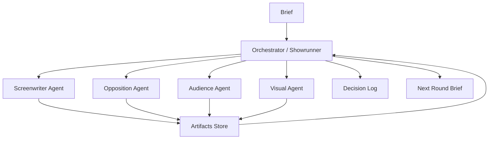

# Real Agent Team Implementation

## 先划清边界

`@编剧 @观众 @导演` 这种写法本身不是 Agent Team。

它只是一个交互语法。真正是不是 Agent Team，取决于背后有没有独立执行。

## 三种模式

| 模式 | 本质 | 能否算 Agent Team | 适用场景 |
|---|---|---:|---|
| Role Prompt | 一个模型在一个上下文里扮演多角色 | 否 | 快速草拟、低成本讨论 |
| Multi-call Agents | 同一个模型多次独立调用，每次只拿角色所需上下文 | 部分算 | 轻量产品验证 |
| Real Agent Runtime | 独立 agent、独立任务、独立产物、可并行、可回合协作、由 orchestrator 聚合 | 是 | 严肃验证 scaling agent collaboration |

## 真 Agent Team 的最低标准

必须同时满足：

1. **独立上下文**
   每个 Agent 只拿自己需要的信息，而不是共享完整对话。

2. **独立任务**
   每个 Agent 有明确职责、输入、输出格式、完成标准。

3. **独立产物**
   每个 Agent 输出单独文件或结构化对象，例如 `screenwriter.md`、`opposition_report.md`。

4. **并行或多轮协作**
   Agent 可以并行工作，也可以在 debate / review loop 中读取彼此产物后再回应。

5. **Orchestrator 聚合**
   Showrunner 不只是总结，而是做取舍、写 decision log、生成下一轮 brief。

6. **可追踪**
   每个决定能追溯到哪个 Agent 的哪条意见。

## 推荐实现架构



## 第一阶段：在 Codex 当前对话里实现

当前环境里，我可以真正启动 sub-agent。

做法：

- 我显式创建独立子 Agent。
- 每个子 Agent 拿不同任务。
- 它们各自返回独立结论。
- 我作为 Showrunner 聚合。
- 你作为 Human 参与拍板。

这才算本轮对话里的“真 Agent Team”。

示例：

```text
spawn 编剧 Agent:
  只负责把故事发展成 3 个后半段方案。

spawn 反方编剧 Agent:
  只负责攻击这些方案的俗套、风险和逻辑漏洞。

spawn 观众 Agent:
  只负责判断观看欲、理解成本、记忆点。

parent / Showrunner:
  聚合三方意见，结合 Human 判断，输出定稿方向。
```

注意：

- 只有当我明确说“我现在启动真实子 Agent”并实际创建子 Agent，才是真 Agent Team。
- 如果我只是用 `@编剧` 分段回答，那只是模拟。

## 第二阶段：在产品 / 仓库里实现

需要一个 Orchestrator 脚本或服务。

核心模块：

```text
AgentSpec:
  id
  role
  system_prompt
  input_selector
  output_schema
  token_budget
  dependencies

ArtifactStore:
  run_id
  stage_id
  agent_id
  output_path
  metadata

Orchestrator:
  load brief
  dispatch agents
  collect artifacts
  run debate loop
  run judge/synthesis
  write decision log
```

## 推荐数据流

### Round 1：创意发散

并行：

- 编剧 Agent 输出 3 个故事方向。
- 观众 Agent 输出观众兴趣和困惑预测。
- 反方编剧 Agent 输出风险清单。

聚合：

- Showrunner 选择 1 个方向或混合方案。
- Human 给直觉判断。

### Round 2：剧本结构

并行：

- 编剧 Agent 写四段式结构。
- 剧本医生 Agent 查结构问题。
- 观众 Agent 查理解成本。

聚合：

- Showrunner 生成 `screenplay_revision_brief.md`。

### Round 3：视觉和分镜

串并结合：

- 美术 Agent 启发 Human 找参考。
- Human 粘贴 style skill。
- 美术 Agent 清洗为 visual bible。
- 导演 / 摄影 / 剪辑 / 演技指导参与分镜。

### Round 4：Prompt 生成与过审

串行：

- Prompt Structurer 生成即梦 prompt。
- Prompt Compliance Reviewer 过审。
- 审片人检查是否可执行。
- Human 决定是否进入生成。

## 验证真伪的检查表

如果一个系统说自己是 Agent Team，问它：

```text
[ ] 每个 Agent 有没有独立输入？
[ ] 每个 Agent 有没有独立输出？
[ ] 是否能看到每个 Agent 的原始产物？
[ ] 是否有 debate 或 review loop？
[ ] 是否有 decision log？
[ ] 是否能复现实验？
[ ] 是否记录 token / 成本 / 轮次？
```

如果都没有，那就是角色扮演。

## 产品 UI 建议

UI 不应该只显示 `@编剧`。

应该显示：

- Agent 状态：pending / running / done / blocked
- Agent 输入：它看到了哪些材料
- Agent 输出：它写了什么
- Human 决策点：需要用户拍板什么
- Showrunner 决策日志：为什么选这个方向

这样用户才会相信这是真协作，而不是一个模型在演多个人。
